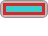

# Buketan

Buketan is a tool for generation of Android image resources from SVG images.

## Purpose

Want to quickly prototype your new Android application? Just draw or find SVG file (I like http://thenounproject.com), put it into special directory and Buketan will create PNG resources and required XML files for different screen densities and Android platform versions according (well, almost) to guidelines.

Of course, creating all icons by hands is always better, but it is not always possible or needed.

## Examples

Below are source SVG images and resources they produce.
In fact, source images are rendered PNGs, because GitHub doesn't return correct MIME type for SVG files, but you may click on image to view actual SVG.

### Action bar icon

[ chat.action-bar.svg](svgs/chat.action-bar.svg)
⇓
- [ drawable-hdpi/chat.png](resources/drawable-hdpi/chat.png)
- [ drawable-mdpi/chat.png](resources/drawable-mdpi/chat.png)
- [ drawable-ldpi/chat.png](resources/drawable-ldpi/chat.png)

### Notification icon

[ location.notification.svg](svgs/location.notification.svg)
⇓
- [ drawable-hdpi/chat.png](resources/drawable-hdpi/location.png)
- [ drawable-mdpi/chat.png](resources/drawable-mdpi/location.png)
- [ drawable-ldpi/chat.png](resources/drawable-ldpi/location.png)
- [ drawable-hdpi-v9/chat.png](resources/drawable-hdpi-v9/location.png)
- [ drawable-mdpi-v9/chat.png](resources/drawable-mdpi-v9/location.png)
- [ drawable-ldpi-v9/chat.png](resources/drawable-ldpi-v9/location.png)
- [ drawable-hdpi-v11/chat.png](resources/drawable-hdpi-v11/location.png) (it's white with transparent background, so it's not visible in browser)
- [ drawable-mdpi-v11/chat.png](resources/drawable-mdpi-v11/location.png) (it's white with transparent background, so it's not visible in browser)
- [ drawable-ldpi-v11/chat.png](resources/drawable-ldpi-v11/location.png) (it's white with transparent background, so it's not visible in browser)

### Tab icon

[ camera.tab.svg](svgs/camera.tab.svg)
⇓
- resources/drawable-v5
    - [camera.xml](resources/drawable-v5/camera.xml)
- resources/drawable-hdpi-v5
    - [ camera_selected.png](resources/drawable-hdpi-v5/camera_selected.png)
    - [ camera_unselected.png](resources/drawable-hdpi-v5/camera_unselected.png)
- resources/drawable-mdpi-v5
    - [ camera_selected.png](resources/drawable-mdpi-v5/camera_selected.png)
    - [ camera_unselected.png](resources/drawable-mdpi-v5/camera_unselected.png)
- resources/drawable-ldpi-v5
    - [ camera_selected.png](resources/drawable-ldpi-v5/camera_selected.png)
    - [ camera_unselected.png](resources/drawable-ldpi-v5/camera_unselected.png)

### 9-patch image

[ test.9.svg](svgs/test.9.svg)
⇓
- [ drawable-hdpi/test.9.png](resources/drawable-hdpi/test.9.png)
- [ drawable-mdpi/test.9.png](resources/drawable-mdpi/test.9.png)
- [ drawable-ldpi/test.9.png](resources/drawable-ldpi/test.9.png)

## Supported resources

* action bar icons
* status bar icons (variants for pre-9, 9-10 and 11 platform versions)
* launcher icons
* list icons
* tab icons
* navigation drawer indicators
* 9-patch resources (additional SVG markup needed)

## Installation

Version 0.1-SNAPSHOT is published to Sonatype OSS Snapshots repository at https://oss.sonatype.org/content/repositories/snapshots , so just add it to you dependency management system.

If you want to be sure you use latest source or you want to hack it yourself, checkout source and publish to local repository with `sbt publish-local`.

## Usage

Buketan currently has three frontends, see below for details:
* command line interface
* SBT plugin
* Ant task

Each of these frontends has batch processing when all SVG files from specified directory are converted into resources. You must name SVG file so that Buketan will know how to convert it.

Example name: `favorite.action-bar.svg`

All image types:
* action-bar
* notification
* launcher
* list-view
* tab
* nav-drawer-indicator
* 9 (for 9-patch images)

If you omit action then buketan will render image with intrinsic size for *mdpi* screen density and scale image appropriately for another densities.

### 9-patch images

9-patch images require additional markup: create rectangle with ID `stretch-area` and (optionally) rectangle with ID `content-area`. These rectangles may have any color or style as they will be hidden during rendering.
9-patch images are scaled like simple images without action.

## Frontends

### Command line interface

Just execute `sbt cmdline/stage` once. Then you may use `cmdline/target/start` script to start
command line tool from anywhere:

    $ cmdline/target/start --help
    usage: buketan [-h]
                   {action-bar,notification,launcher,list-view,tab,9-patch,batch}
                   ...

    positional arguments:
      {action-bar,notification,launcher,list-view,tab,9-patch,batch}

    optional arguments:
      -h, --help             show this help message and exit

Convert all SVG files in directory:

    $ cmdline/target/start batch svgs-dir resources

Convert just one SVG file with explicit type:

    $ cmdline/target/start action-bar chat.svg resources

### SBT plugin

SBT plugins depends on [SBT Android plugin by jberkel](https://github.com/jberkel/android-plugin).

Just add following to  to your `project/plugins.sbt`:

    resolvers += "Sonatype OSS Snapshots" at "https://oss.sonatype.org/content/repositories/snapshots"

    addSbtPlugin("net.kriomant.buketan" % "sbt-plugin" % "0.1-SNAPSHOT)

include `BuketanPlugin.buketanSettings` to project settings:

    object General {
      ...
      lazy val fullAndroidSettings =
        General.settings ++
        AndroidProject.androidSettings ++
        TypedResources.settings ++
        proguardSettings ++
        AndroidManifestGenerator.settings ++
        BuketanPlugin.buketanSettings ++ // <-----
        AndroidMarketPublish.settings
    }

and put SVG files to `res-svg` directory next to your `res`.

See `test-sbt-project` for reference.

### Ant plugin

Read [Ant plugin documentation](ant-plugin/README.md).

